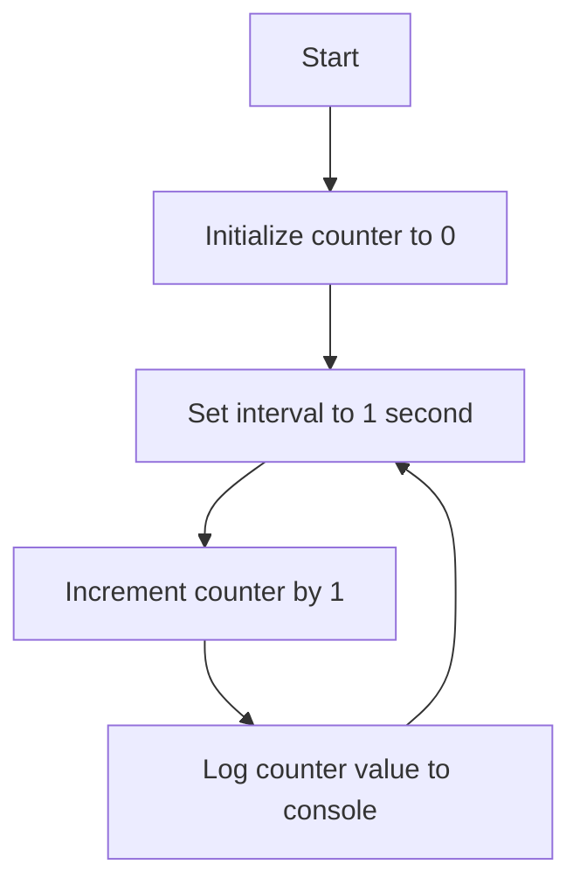

# JavaScript Counter

We have already covered this in the second lesson, but as an easy recap, try to code a counter in JavaScript. It should go up as time goes by in intervals of 1 second.

## Example Code

```javascript
let counter = 0;

setInterval(() => {
    counter++;
    console.log(counter);
}, 1000);
```

## Explanation

### `let counter = 0;`
This line initializes a variable named `counter` and sets its initial value to 0. The `let` keyword is used to declare a block-scoped variable.

### `setInterval(() => { ... }, 1000);`
The `setInterval` function repeatedly calls a function or executes a code snippet, with a fixed time delay between each call. In this case, it is set to execute every 1000 milliseconds (1 second).

### `() => { counter++; console.log(counter); }`
This is an arrow function that increments the `counter` variable by 1 (`counter++`) and then logs the updated value to the console (`console.log(counter)`). The arrow function is a concise way to write anonymous functions in JavaScript.

### Summary
- **Initialization**: The counter starts at 0.
- **Increment**: Every second, the counter is incremented by 1.
- **Logging**: The updated counter value is printed to the console every second.

This simple example demonstrates the use of variables, the `setInterval` function, and arrow functions in JavaScript.

## Flowchart

Below is a flowchart to visualize the logic of the JavaScript counter:



### Difference between `setInterval` and `setTimeout`

- **`setInterval`**: This function repeatedly calls a function or executes a code snippet, with a fixed time delay between each call. It continues to execute until it is explicitly stopped using `clearInterval`.

- **`setTimeout`**: This function calls a function or executes a code snippet after a specified delay (in milliseconds). It only executes the function once.

#### Example of `setTimeout`:
```javascript
setTimeout(() => {
    console.log('This message is displayed after 2 seconds');
}, 2000);
```

In this example, the message will be logged to the console once after a delay of 2 seconds.
