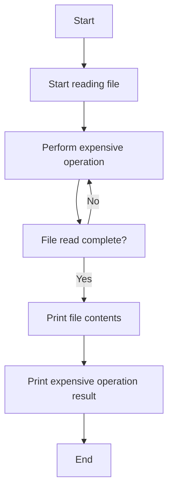

# Reading the Contents of a File

Write code to read the contents of a file and print it to the console. Use the `fs` library to understand async tasks. Perform an expensive operation below the file read and observe how it affects the output. Make the expensive operation more and more expensive and see how it affects the output.

## Example Code

```javascript
const fs = require('fs');

console.log('Start reading file...');

fs.readFile('example.txt', 'utf8', (err, data) => {
    if (err) {
        console.error(err);
        return;
    }
    console.log('File contents:', data);
});

console.log('Performing an expensive operation...');

let sum = 0;
for (let i = 0; i < 1e9; i++) {
    sum += i;
}

console.log('Expensive operation completed:', sum);
```

## Explanation

### Key Concepts

- **Asynchronous File Read**: The `fs.readFile` function reads the file asynchronously, allowing other code to execute while waiting for the file read to complete.
- **Callback Function**: The callback function in `fs.readFile` is executed once the file read is complete.
- **Expensive Operation**: The loop simulates an expensive operation that runs while the file is being read.

### Observations

- The message "Start reading file..." is printed first.
- The expensive operation starts and runs while the file is being read.
- The file contents are printed after the file read is complete, even if the expensive operation is still running.

## Flowchart

Below is a flowchart to visualize the process:


